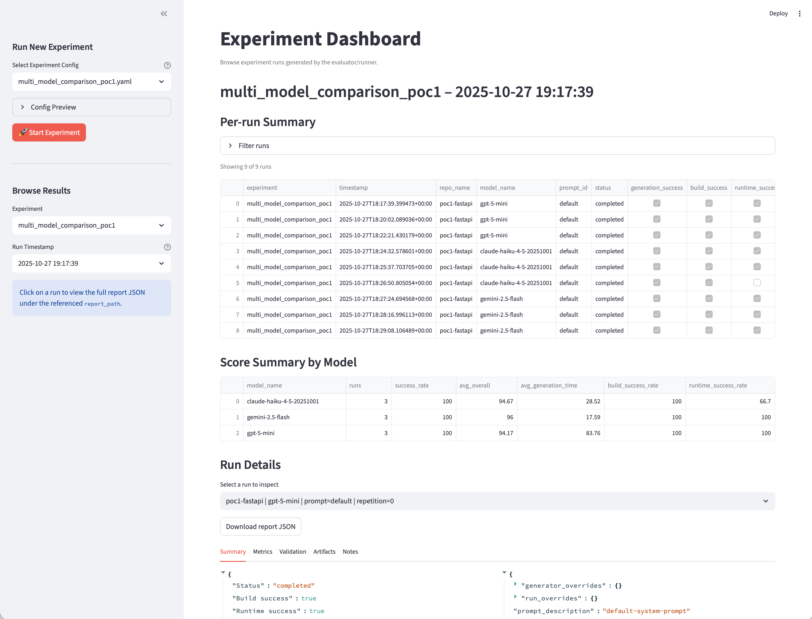

# LLM-Driven Runtime Configuration Platform

Automation toolkit powered by an LLM agent for generating, validating, and analysing container/Kubernetes configurations across Git repositories. The stack couples agentic generation with Docker/K8s validation, experiment orchestration, and reporting utilities to support research and future PaaS-style deployments.

## Repository Layout

```
├── generator.py            # Thin CLI wrapper around the configuration generator
├── evaluator.py            # Entry point for end-to-end evaluation runs
├── run_experiments.py      # Configurable experiment runner
├── src/
│   ├── generator/          # Agents, workspace, and config models for generation
│   ├── evaluator/          # Evaluation flows, validators, reports, experiments
│   ├── runtime/            # Reusable Docker/Kubernetes runtime helpers
│   ├── common/             # Shared command runner and data models
│   ├── utils/              # Miscellaneous utilities (e.g., repo helpers)
│   └── tools/              # Operational scripts (cluster cleanup, etc.)
├── experiments/            # YAML experiment configurations
├── prompts/                # Prompt variants referenced by experiments
├── evaluation_reports/     # Generated reports (ignored by git)
├── docs/                   # Additional design notes and references
└── ui/                     # Streamlit dashboard for experiment insights
```

## Getting Started

1. **Set up Python environment (3.11+ recommended):**
   ```bash
   python -m venv .venv
   source .venv/bin/activate
   pip install -r requirements.txt
   ```
2. **Configure secrets and runtime settings:**
   - Copy `.env.template` to `.env` and fill in the required values. Generating configurations needs an LLM API key (`OPENAI_API_KEY`, `ANTHROPIC_API_KEY`, or `GOOGLE_API_KEY`).
   - For evaluation/runtime checks, make sure `kubectl` is pointed at the target cluster and set `REGISTRY_URL` plus `K8S_CLUSTER_IP`.
   - To enable LangSmith tracing, provide `LANGSMITH_TRACING`, `LANGSMITH_ENDPOINT`, `LANGSMITH_API_KEY`, and `LANGSMITH_PROJECT`.
   - Ensure Docker (with buildx) and `kubectl` are available locally.
   - Additional provider credentials for upcoming models are outlined in `docs/llm_support.md`.
3. **Optional extras:**
   - Install Streamlit and pandas if you plan to use the experiment dashboard:
     ```bash
     pip install streamlit pandas
     ```

## Core Workflows

### Generate Configurations

- Run the generator against a repository via CLI:
  ```bash
  python generator.py
  ```
  Edit the constant inside `generator.py` or trigger `ConfigurationGenerator(...).generate(<repo_url>)` from an interactive session for ad-hoc repos.

### Evaluate a Repository

- Score a single repo (or the curated list if URL omitted):
  ```bash
  python evaluator.py https://github.com/org/repo.git
  ```
  Reports are persisted under `evaluation_reports/<timestamp>/`.

### Run Experiments

- Execute experiment suites defined in `experiments/*.yaml`:
  ```bash
  scripts/run_experiment.sh experiments/sample.yaml
  ```
  Summaries land in `evaluation_reports/experiments/<name>/<timestamp>/` and include prompt metadata, scores, and runtime metrics.

### Build Repository Datasets

- Discover GitHub repositories that match your filters and persist them for reuse:
  ```bash
  python dataset_builder.py discover --name python-webapps --language Python --topic webapp --min-stars 200 --limit 100
  ```
  Set `GITHUB_TOKEN` (or `GH_TOKEN`) to increase rate limits when crawling. Datasets are written to `evaluation_reports/datasets/<name>.json` unless an explicit `--output` path is supplied.
- Convert a saved dataset into an experiment configuration:
  ```bash
  python dataset_builder.py to-experiment --dataset evaluation_reports/datasets/python-webapps.json \
    --output experiments/python-webapps.yaml \
    --name python-webapps \
    --models path/to/models.yaml \
    --top-n 25
  ```
  The YAML emitted by this command can be executed with `python run_experiments.py --config ...` or the corresponding shell script.

### Explore Results

- Launch the Streamlit dashboard for high-level comparisons:
  ```bash
  scripts/run_ui.sh
  ```
  

### Clean Up Cluster Namespaces

- Run the cleanup helper to prune leftover namespaces and hosts entries:
  ```bash
  scripts/cleanup.sh
  ```

For deeper architectural details, review the documentation under `docs/` and inline module docstrings throughout `src/`.
