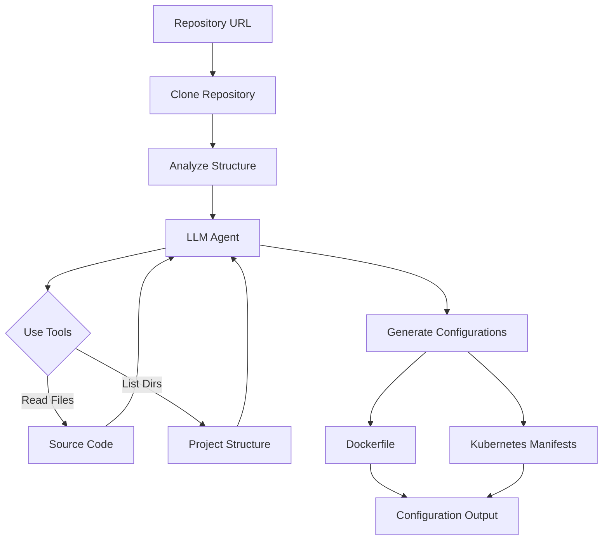
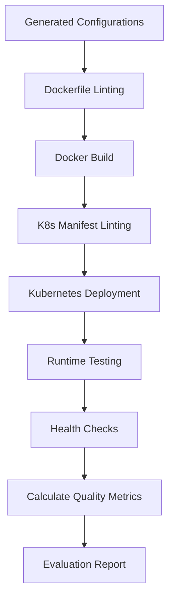

# Architecture Diagrams

## Configuration Generation

```mermaid
flowchart TD
    Start[Repository URL] --> Clone[Clone Repository]
    Clone --> Analyze[Analyze Structure]
    Analyze --> LLM[LLM Agent]
    LLM --> Tools{Use Tools}
    Tools -->|Read Files| Code[Source Code]
    Tools -->|List Dirs| Structure[Project Structure]
    Code --> LLM
    Structure --> LLM
    LLM --> Generate[Generate Configurations]
    Generate --> Docker[Dockerfile]
    Generate --> K8s[Kubernetes Manifests]
    Docker --> Output[Configuration Output]
    K8s --> Output
```

## Configuration Evaluation

```mermaid
flowchart TD
    Input[Generated Configurations] --> DockerLint[Dockerfile Linting]
    DockerLint --> Build[Docker Build]
    Build --> K8sLint[K8s Manifest Linting]
    K8sLint --> Deploy[Kubernetes Deployment]
    Deploy --> Runtime[Runtime Testing]
    Runtime --> Health[Health Checks]
    Health --> Metrics[Calculate Quality Metrics]
    Metrics --> Report[Evaluation Report]
```
